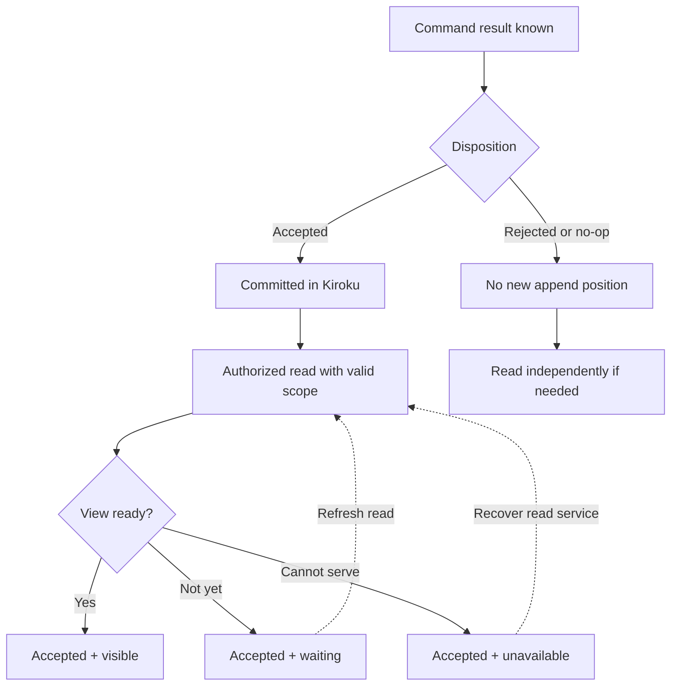

# Separate command disposition from read visibility

## Problem and applicability

A mutation can commit while its response is lost, or return successfully before a projection catches up. The client needs separate answers to “was my intent processed?” and “can this view show it?” Use this contract for retryable mutations and command status endpoints. Field names below are an illustrative application wire contract, not exported Keiro record fields.

## Book principle and source layer

The [generator notes](mori://shinzui/event-sourcing-full-app-patterns/docs/command-generator) describe request identities, typed failures, and a revision/position for observing results. [Constraints and principles](mori://shinzui/event-sourcing-full-app-patterns/docs/constraints-and-principles) motivates semantic mutations and real-time support. Their `visibleAsOf` illustrations must be translated into a scoped runtime position; they do not establish a global position across independent services.

## Runtime baseline

Inherit [command cycle and errors](mori://shinzui/keiro-runtime-patterns/docs/keiro-command-cycle-and-errors) for request receipts and domain outcomes, and [read models and projections](mori://shinzui/keiro-runtime-patterns/docs/keiro-read-models-and-projections) for actual waiting and guarded reads. The runtime supplies transaction/append primitives. The application owns operation lookup, authorization, receipt retention, and the external result vocabulary.

## Application recommendation

An accepted command and its view can be in different states. Follow the read branch without changing the committed command result.

Pending or unknown results require authorized operation-status lookup first. Visibility retries do not resubmit the command, and silent outcomes never acquire a synthetic position.

Keep operation disposition and visibility as separate values. An accepted domain result means its nonempty event batch committed; it does not mean a notification was sent or a screen is fresh. Pending means durable intake is known but no final decision is yet available. Unknown means the observer cannot establish a durable result; it is not a negative business decision.

| Value | Producer and scope | Absence and interpretation |
|---|---|---|
| `operationId` | Caller, scoped by tenant/context, action, and target | Required for the repeatable-retry contract; not a globally comparable position |
| request fingerprint | Owning service, canonical semantic payload including expected revision and captured decision inputs | Internal, required for detecting conflicting reuse; never use an untrusted caller hash as proof |
| `disposition` | Owning application: accepted, rejected, no_op, pending, or unknown | Required; authorization/input failures may be separate API errors before admission |
| `reason` | Domain/application, bounded public code | Required for rejection and no-op; do not leak raw stored payloads or infrastructure exceptions |
| `streamRevision` | Runtime result for this exact target | Final accepted/silent results carry the observed version; pending/unknown may omit it; a silent result does not certify a new append |
| `commitPosition` | Runtime append result, paired with source-store identity | Present for an accepted append, absent for silent outcomes; never fabricate zero or promote a stream revision into this field |
| `visibility` | Authorized read service for a named model and relevant generation/source scope | visible, waiting, unavailable, or not_requested; include its evidence scope, not a bare optimistic flag |

A read may wait for an accepted command's position only when that model's durable cursor proves coverage of the relevant source. A command with no appended event has no new position to wait for: query its current authorized view independently, or use an explicitly supported scoped stream predicate. Never hang waiting for a synthetic no-op position. A model's visibility failure does not revise an accepted disposition.

The retry contract is application-owned: reuse an operation identity only for the same semantic request, serialize competing duplicates, and recover the original durable outcome where promised. Reference the baseline receipt standard for storage mechanics; do not substitute the integration inbox. Accepted outcomes can use transaction-coupled receipt evidence, while silent outcomes require their own serialized receipt path because no after-append callback runs. Applications that reevaluate silent requests instead must say so and must not advertise repeatable original-result semantics.

For durable asynchronous intake, return pending only after the input is durable, provide an authorized status lookup with a declared retention horizon, and run the worker that advances it. If awaiting results through a transient channel, establish the listener before submission and recheck durable status after attaching and on timeout. This avoids treating notification loss as result loss. Bound every wait. If lookup is unavailable, retain unknown and retry lookup with the same identity; receipt absence alone after an uncertain request is not proof that it never committed.

## Alternatives and divergences

A single success/error boolean cannot express this flow. Prefer typed business outcomes plus separate visibility over a catch-all transport error. This supplements the runtime contracts rather than changing their atomicity. GraphQL is the external style in the notes; the contract does not require exposing internal event positions directly to untrusted clients. An opaque signed/validated token may carry store/model scope instead, with bounds checked by the service.

For a low-risk command without repeatable receipts, explicitly state that retries reevaluate current state. Do not present that weaker option as equivalent to replaying the original outcome. An expired receipt is an expired guarantee: return a documented expiry/reconciliation outcome, not a silent fresh execution of the old key.

## Failure and recovery

| Scenario | Disposition and action | Visibility |
|---|---|---|
| Configured inactive chapter commits activation | accepted; retain result under the operation key | Query/wait for this source position |
| Configuration missing | rejected, ConfigurationRequired | No append-derived wait |
| Chapter already active | no_op, AlreadyActive | Read independently; no invented position |
| Same key, same payload after lost response | Recover original final result or report pending/unknown | Keep original committed position if present |
| Same key, different payload | API identity conflict; no second execution | No new visibility target |
| Concurrent identical submissions | One protected operation; others observe its state | Do not mint independent acceptance results |
| Store unavailable before a proven result | API unavailable/unknown as evidence warrants | Do not claim visibility |
| Accepted command, projection times out | Keep accepted; show “saved, view updating” | waiting or unavailable; refresh, do not resubmit |

## Evidence

The source-verified `CommandResult` has a scoped stream version and optional global position. The typed domain branches and callback-skipping tests are detailed in [evidence](../../docs/validation/command-composition.md). The receipt and wire protocol above are design obligations, not a built-in service. Use [generation and processing](generation-and-processing.md) to choose direct versus asynchronous intake.
