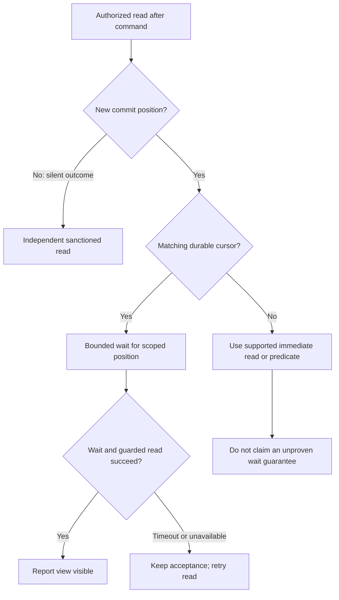

# Read a business view with scoped freshness

## Problem and applicability

The activation mutation returns accepted, yet the detail screen still shows inactive. The screen needs an explicit freshness contract, not a sleep followed by an optimistic claim. Use this pattern whenever queries read asynchronously derived state or multiple models are combined into one screen.

## Book principle and source layer

The [materializer notes](mori://shinzui/event-sourcing-full-app-patterns/docs/event-materializer) recommend views shaped for user workflows, checkpointed updates, and separation from irreversible effects. The [expansion notes](mori://shinzui/event-sourcing-full-app-patterns/docs/expansion-points-and-beyond) discuss parallel materialization and more complicated checkpoints. Their illustrative `visibleAsOf` handlers are adaptations; for Kiroku-backed views, use the runtime's scoped freshness contract.

## Runtime baseline

Inherit [read models and projections](mori://shinzui/keiro-runtime-patterns/docs/keiro-read-models-and-projections), [catalogs](mori://shinzui/keiro-runtime-patterns/docs/keiro-projection-catalogs), and [transactional projections](mori://shinzui/keiro-runtime-patterns/docs/kiroku-transactions-and-projections). They own query builders, cursor authority, catalog lifecycle, inline/async delivery, deduplication, and rebuild procedures. This pattern defines how the application chooses and reports the resulting guarantees.

## Application recommendation

Choose a freshness path from the model’s actual capabilities and the command’s result, rather than from a generic success flag.

All paths retain model lifecycle checks and application authorization. A position from another source is invalid for this wait; a cursorless model cannot satisfy it by inventing a cursor.

Design a chapter detail view around the screen: identity, activity state, relevant configuration, authorized actions, and a model revision. The query shape is not a raw domain event shape. Derived values must be reproducible from recorded inputs; display formatting can remain at the presentation boundary. A projection replay must not become a second notification workflow.

For the activation result, consume the [command contract](../commands/outcomes-and-visibility.md). An accepted append can supply a store-scoped target position. An async model may wait for it only if its declared durable cursor actually covers the source and its update protocol establishes the needed contiguous progress. Keiro's `runQueryWithFreshness` supports Immediate, WaitForHead, and WaitForPosition; use the runtime guide for construction and guarantees. A cursorless inline model must use its sanctioned immediate read after the relevant commit rather than a fabricated wait cursor. Do not request waiting just because the API field was called `visibleAsOf` in an old example.

For a single-source ordered chapter projection, declare exactly which subscription proves coverage and which model generation serves the read. Return a scoped observation or opaque validated token with the response when clients need comparison. For multiple independent sources, represent each required frontier separately or expose an application-defined barrier backed by real evidence. Taking the maximum seen position, mixing stores, or comparing an event position to a per-stream revision is not such a barrier. A partially updated command batch must not be advertised as a complete command view; choose the baseline transaction/group semantics to match that requirement.

Give each screen an explicit policy: ordinary browsing can show its current view with freshness status; immediately after a write it can wait within a bounded budget for the relevant target; on timeout it can keep “saved, view updating” and retry the read. A missing registration, incompatible shape, or non-live model is a serving problem, not evidence that the user's command failed. Do not hide these behind a successful stale payload.

During rebuild, inherit the registered catalog lifecycle. Offline reconstruction can make the view unavailable; show a specific retryable state. Online reconstruction can keep the existing serving version until verified promotion. Clients invalidate old generation assumptions and requery after promotion. Retained old tables are not a live rollback API. Out-of-process API readers use the sanctioned versioned external-read contract and grants, not a status query followed by raw table SELECT. The application still owns row/tenant authorization; a lifecycle guard is not an end-user authorization policy.

## Alternatives and divergences

This supplements the book and runtime; it does not replace their projection implementation. Inline application is useful for a small view that must commit with the write, but couples the write to that view's availability and work. Async application permits independent progress with an explicit lag state. The choice is a business latency/availability decision, not a claim that one mode is always correct. Separate immediate reads from guarantees about a specific write; the word “strong” alone is insufficient.

## Failure and recovery

Duplicate delivery uses the runtime projection protocol, not a second business action. If a projection is fenced, stop advancing past unhandled work as the baseline requires. If a query target is from a different store or outside the contract, reject it rather than wait indefinitely. If the authorized result no longer contains the chapter, return the proper absence/authorization outcome instead of reconstructing private state from events. On a visibility timeout retain acceptance and refresh; on unavailable generation retain the command receipt and let the view recover. Alert on the owning model's lag/failure using existing telemetry, with request-to-command-to-view correlation rather than unbounded payload labels.

## Evidence

[Flow evidence](../../docs/validation/business-application-flow.md) names current query builders, actual cursor checks, and external-read regression sources. These were inspected, not reimplemented here. This catalog defines application observation semantics; it does not claim a deployed projection.
