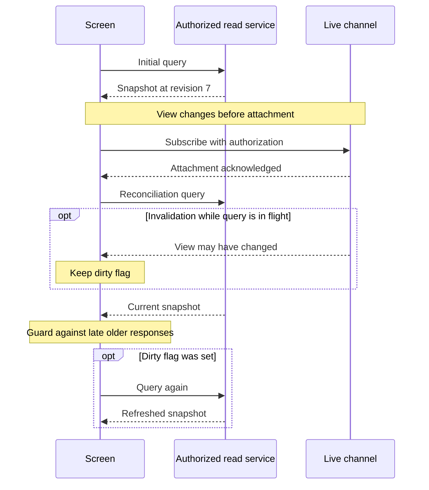

# Load a snapshot and reconcile live updates

## Problem and applicability

An initial query reads inactive, activation commits before the live listener attaches, and no later notification arrives. A screen can then remain wrong forever. Use this pattern for live screens and reconnect recovery; ordinary screens may use queries alone with an explicit refresh policy.

## Book principle and source layer

The [materializer notes](mori://shinzui/event-sourcing-full-app-patterns/docs/event-materializer) describe initial-state-plus-updates/live queries. The later [query-first rationale](mori://shinzui/event-sourcing-full-app-patterns/docs/screen-data-query-first-rationale) and [Relay guide](mori://shinzui/event-sourcing-full-app-patterns/docs/frontend-relay-patterns) are platform adaptations, not universal book constraints. Query-first is a useful rendering choice but the simple query-then-subscribe diagram alone does not close the handoff race.

## Runtime baseline

Inherit [read-model semantics](mori://shinzui/keiro-runtime-patterns/docs/keiro-read-models-and-projections) and [private event consumption](mori://shinzui/keiro-runtime-patterns/docs/messaging-kiroku-subscriptions). A server-side event cursor is not automatically a resumable browser cursor. Neither standard supplies an application GraphQL/Relay server or certifies its end-user authorization. The local contribution is the handoff and recovery protocol at that boundary.

## Application recommendation

The second query closes the attachment gap. Notifications received during reconciliation must survive until another read can consume them.

This is an invalidation protocol, not a durable event stream. Reauthorize and reconcile on reconnect; successful fallback refreshes recover missed hints after attachment.

Prefer an authorized route-level query for the first useful screen. Let components consume normalized identities and bounded connections as the [Relay guide](mori://shinzui/event-sourcing-full-app-patterns/docs/frontend-relay-patterns) describes; do not create one independent live stream per component. Attach live updates only where the user benefits.

For an invalidation-based channel, subscribe and wait for the server's attachment acknowledgment, then requery the authoritative read model. The first query can render quickly; the post-attachment query repairs changes that occurred before listening. Treat each notification as “this view may have changed,” not as proof of a specific command outcome. While a query is in flight, latch another invalidation as dirty and requery again after completion. Coalescing is safe only if a dirty signal is not dropped at the start/end boundary. Bound work and surface lag under sustained change rather than create an unbounded queue of snapshots.

Use a request generation to prevent a slow initial response from overwriting a newer reconciliation. Scope comparison to the same model, query arguments, authorization context, and serving generation. Within a supported comparable model version, ignore older node revisions. On generation changes or incompatible tokens, requery instead of comparing unrelated counters. Connection inserts/removals and pagination can affect edges, counts, and ordering, not just an entity record; refetch the affected connection unless the API defines a complete, ordered patch contract.

Ephemeral notifications can still be lost after attachment. Requery on reconnect and visibility/focus recovery, and use a bounded refresh interval appropriate to the product when a missed update must eventually be discovered. The stale bound is conditional on successful queries and bounded projection lag; during outages display stale/unavailable rather than promise a deadline. This provides eventual reconciliation, **not lossless event delivery**. If attachment cannot be acknowledged reliably, rely on the query/polling path for correctness.

A truly resumable snapshot-and-stream endpoint is an alternative only when the server supplies a snapshot and cursor with a gap-free relationship, authorized replay after that cursor, retention/expiry rules, and explicit resync on expiry. That endpoint may safely bootstrap a screen; the earlier adaptation's blanket ban on subscription-only bootstrapping is too broad for this contract. Do not implement it by sending an arbitrary snapshot once on a lossy subscription and calling the result durable.

Authorize the initial query, attachment, every delivery as required by the resource policy, and reconnect. An expired or revoked permission stops delivery and removes inaccessible client state; do not “repair” it by polling a private table. On a changed user/tenant, discard old query responses and subscriptions. Initial authentication alone does not establish permanent authorization.

## Alternatives and divergences

The main recommendation supplements query-first loading with attachment acknowledgment and requery. The explicit divergence is conditional acceptance of a proven snapshot-and-stream server contract, versus the platform guide's blanket query-first rule. Choose it only when that stronger service exists and its retention/replay cost is justified. In this catalog no such browser service has been implemented or verified, so the supported design fallback is authorized query plus invalidation/requery or polling.

The Haskell and TypeScript subscription-flow guides remain architectural inputs; their snippets are not proof that external readers bypassing current guarded SQL are safe. Keep API implementation choice separate from runtime guarantees. A Keiro/Kiroku subscription should never be exposed as another context's private event feed to make a UI easier.

## Failure and recovery

A change between the first query and attachment is recovered by the post-attachment query. A change during that query marks dirty and triggers the next query. Duplicate invalidations coalesce; reordered hints do not roll back state because responses come from the authoritative view and use a response guard. A reconnect repeats authorization, attachment, and reconciliation; it does not assume continuity. Lost hints after attachment need the fallback refresh policy. A rejected read remains a rejected read, not a blank success; an accepted mutation retains its separate receipt when the screen cannot reload.

## Evidence

Run `python3 scripts/check-screen-handoff.py` from the repository root for an exhaustive small ordering model. It demonstrates the naive gap, stale-response regression, and the effects of reconciliation/response guarding. It does not test network durability, database atomicity, server authorization, or projection lag. [Flow evidence](../../docs/validation/business-application-flow.md) records the source review and those limits. [ADR-3](../../docs/adr/0003-reconcile-live-screens-through-authorized-read-contracts.md) records this application boundary.
